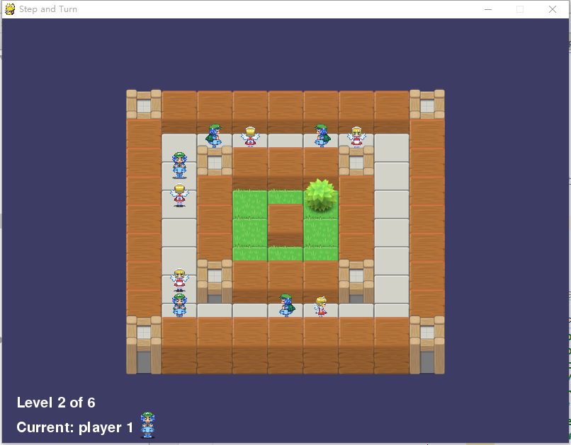

# Step and Turn Game!

* This is my AI project for graph search.
* Use [pygame](http://www.pygame.org/download.shtml) framework.
* Test on Windows10.

## Game rules
* Two players take turns to action.
* There are pieces and obstacles on the board, and each player controls some pieces.
* Each piece has four directions. The possible actions of the pieces are to step forward in the current direction (**step**) and to turn left or right (**turn**).
* When a player is on the turn, the player chooses a piece to **step**, then selects a piece to **turn**. The selected pieces can be the same or different.
* The moved piece cannot overlap with obstructions and other chess pieces.
* The first player who can not move is sentenced to failure!

## UI design
* Start up page
	
* Main UI
	
* Hints
	* 
	* 

## How to make contribution
You are always welcomed to contribute to this project!
* If you find a bug, open a new issue.
* If you want to design a new map, see the examples in `src/stepturnLevel.txt` and add your own secretly or make a pull request.
* And there are definately bugs in the code for someone to fix...

## Acknowledge
* Sweigart's [pygame book](http://inventwithpython.com/pygame/) and [star pusher example](http://inventwithpython.com/pygame/chapter9.html) helps me a lot. This game is adapted from his star pusher game.
* AI framework provided by [easyAI](https://github.com/Zulko/easyAI). I've made some changes to adapt to this game (You don't need to install this package).

## LICENSE
MIT